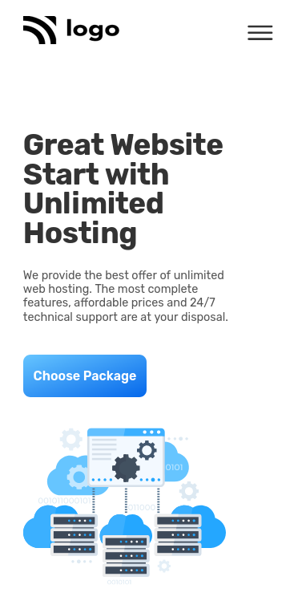

# PROJECT 11 - Hosting website

This is the 11th project-challenge among the 15 Ineuron-projects.
Its a device responsive built completly with html and css.

## Table of contents

- [Overview](#overview)
  - [Screenshot](#screenshot)
  - [Links](#links)
- [My process](#my-process)
  - [Built with](#built-with)
  - [Time required](#time-required)
  - [What I learned](#continues-development)
  - [Useful resources](#useful-resources)
- [Author](#author)
- [Acknowledgments](#acknowledgments)

## Overview

### Screenshot




### Links

- Code File URL: [github.com](https://github.com/Jyotimoykathar/Project-02)
- Live Site URL: [netlify.app](https://project-02-restaurant.netlify.app/)

## My process

### Built with

- Semantic HTML5 markup
- CSS custom properties
- Flexbox Css
- Grid Css

### Time required

Nearly 4 days required to placed position with grid and media queries.

### What I learned

This is the css design code snippet media queries.

```css
/**************************/
/* BELOW 544px (Phones) */
/**************************/
@media (max-width: 34em) {
  .grid {
    row-gap: 4.8rem;
  }

  .grid--2-cols,
  .grid--3-cols,
  .grid--5-cols {
    grid-template-columns: 1fr;
  }
  .grid--5-cols {
    grid-template-columns: repeat(2, 1fr);
    align-items: start;
  }

  .btn,
  .btn:link,
  .btn:visited {
    padding: 1.6rem 1.6rem;
  }

  .description {
    line-height: 1.2;
    font-size: 1.8rem;
    margin-bottom: 4.8rem;
  }
  .customer-section .description.top {
    margin: 3.2rem 6.4rem;
    text-align: left;
    padding: 0 0.8rem;
  }

  .left-image,
  .right-image {
    width: 80%;
  }

  .nav img {
    height: 4.4rem;
  }
}
```

### Continued development

I still have a lot to learn about flexbox and Grid. Responsive need to be more slig and animation, interactive need to be added.

### Useful resources

- [MDN](https://developer.mozilla.org/en-US/) - This website helped me to any thing i had to look upon.
- [ION ICON](https://ionic.io/ionicons) - Free Open Source Icons, that are very easy to implement in your code.

## Author

- Github page- [Jyotimoykathar](https://github.com/Jyotimoykathar/)

## Acknowledgments

Special Thanks to Ineuron team for the project-challange to improve my CSS flexbox, grid and media querie skills.
